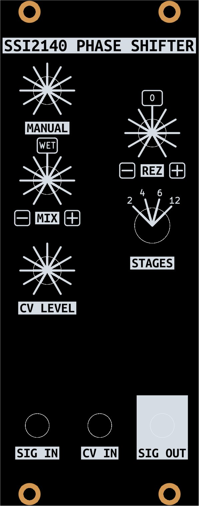

# SSI2140 Phase Shifter

---

## [SCHEMATIC]()

---

### Features
- Eurorack 12 stage phase shifter
- Selectable number of stages (2, 4, 6, and 12)
- Positive and negative feedback
- Positive and negative wet/dry mix
- 1 attenuated CV input with approximately 1V/OCT response

---

## Status of the project:

Task | Status |
---------|--------------|
Schematic capture | &#9745;
PCB layout | &#9745;
Test build | &#9745;
Safe to order boards| &#9745;